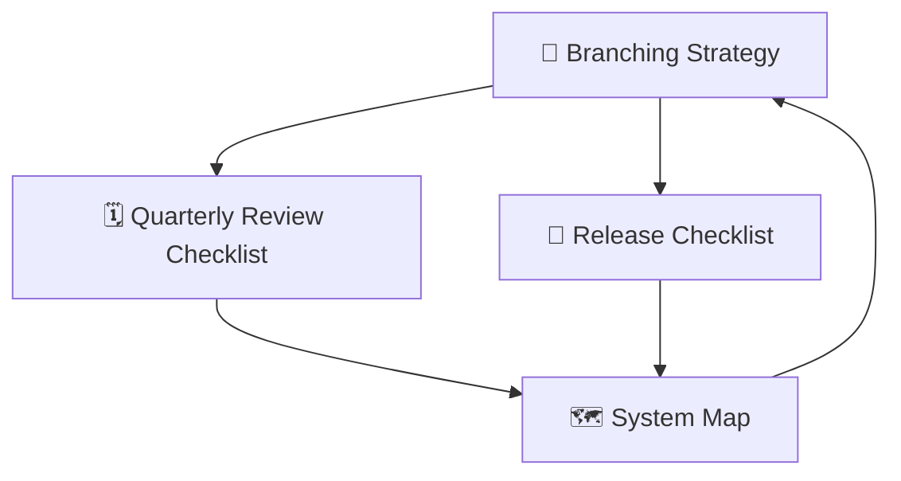

# Architecture Governance Reviews

This folder contains the **governance playbooks and review guides** that keep our architecture consistent, traceable, and future‑proof.

---

## 📚 Contents

- [🌿 Branching Strategy](branching-strategy.md)  
- [🗓️ Quarterly Review Checklist](quarterly-radar-review.md)  
- [📝 Release Checklist](release-checklist.md)  
- [🗺️ System Map](system-map.md)  

---

## 🔗 Related Artifacts

- [📡 Radar](../../best-practices/radar.md)  
- [📦 Capsules](../../best-practices/)  
- [📜 ADR Index](../architecture-decision-records/index.md)  
- [👩‍💻 Onboarding Guide](../onboarding.md)

---

## 🎯 Purpose

This folder is the **operational heart of governance**:

- Ensures every release is **traceable**.  
- Keeps practices **validated and current**.  
- Provides **visuals and checklists** so contributors can follow the process without guesswork.  

Together, these documents form a **living playbook** for architecture and release governance.

---

## 🖼️ Visual Index

